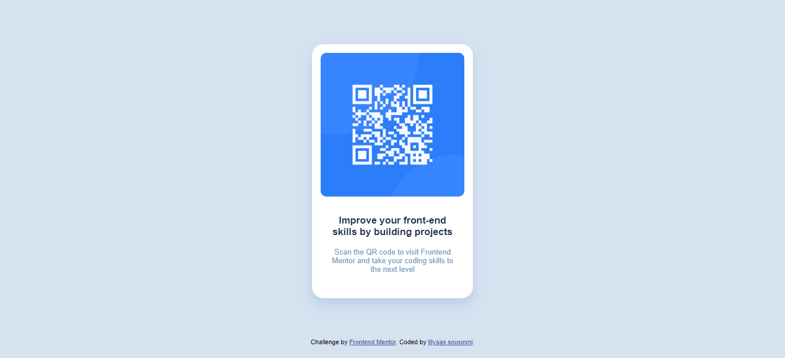

# Frontend Mentor - QR code component solution

This is my solution for the challenge.

## Table of contents
- [Links](#links)
- [My process](#my-process)
  - [Built with](#built-with)
  - [what I learned](#what-i-learned)
  - [Useful resources](#useful-resources)
- [Author](#author)
- [Acknowledgments](#acknowledgments)

## links

- [Solution URL](https://github.com/Illyaas4Show/QR-code-component)
- [Live Site URL](https://glittering-axolotl-6f5eab.netlify.app/)

## My process

### Built with

- HTML
- CSS custom properties
- Flexbox

### What I learned

As this was my first ever coding challenge, I learnt the basics of what it is like to take part in a coding challenge. As I came across different small problems while coding, I learnt from reading different articles that it is impossible to make a project pixel perfect and one should really be striving for as near of a replica as possible. At first, I wasted a lot of time trying to make everything look the same as in the picture while still trying to keep to standard programming practices and not just using little cheats and hacks, but then I realised that I don't need to do that and just need to do the best I can do.

I also learnt how to use custom properties and I believe that with more practise using them, It will be very useful for me in the future.

### Continued development

I would like to continue to work on custom properties as I think it is an interesting area and could help with things like changing the complete layout of a website with a change in just one variable instead of re-programming the full website which would also help with dark mode which I think I will look into later on in my career.

I also want to work on gradually implementing semantic HTML into my code to make it more professional.

### Useful resources

- [Matt Studdert](https://medium.com/frontend-mentor/how-to-get-the-most-out-of-frontend-mentor-bdd6fdc25cb8) - This helped me understand what frontend mentor is all about and how to get started. I would definitely recommend it to anyone who is just starting or needs help with any thing about frontend mentor as it also has links to other sites that may help.

- [“Chasing the pixel-perfect dream” by Josh Comeau](https://www.joshwcomeau.com/css/pixel-perfection/) - This is pretty self explanatory. It helped me understand not to always expect my site to look exactly the same as in the picture which made me worry less and concentrate more on what will make my own project look good.

## Author
- [GitHub](https://github.com/Illyaas4Show/)

Thank you for viewing :smile:
